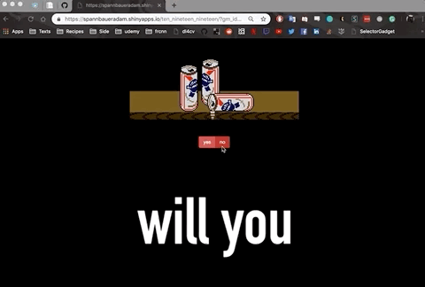

# Shiny Groomposal

R Shiny web app for proposing to my groomsmen.

### Links

* [Valid link for Bryan](https://spannbaueradam.shinyapps.io/ten_nineteen_nineteen/?gm_id=bw)
* [Invalid link](https://spannbaueradam.shinyapps.io/ten_nineteen_nineteen)

### Example usage

  

### Overview

* App works off of a parameterized URL to identify groomsman (only 5 valid ids; not too secure, but worked for my use case)
* Customized groomposal gif was played based of URL identification of groomsman
* Prospective groomsman would then select a response and be greeted by a gif of Michael Scott letting them know how their response made me feel
* Responses were then emailed to me via use of the Mailgun API (emailing is now turned off)